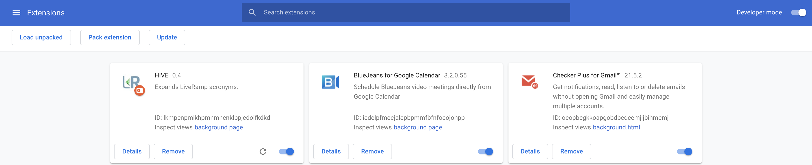

# Extension README
To increase interactivity, we decided to use a chrome extension to be able to directly modify the webpage users are seeing.

## Deployment
The extension metadata is located in the ```manifest.json``` file.
To deploy the app locally for testing purposes:
* Go the Chrome extensions manager: ```chrome://extensions```
* You should see something similar to the following screen:

* Enable the developer mode with the toggle in the top right corner
* Click on the "Load Unpacked" button in the top left corner
* Load the complete ```extension``` folder
* Your extension is deployed for testing !

You can deploy your app to all LiveRampers through [Chrome Web Store](https://chrome.google.com/webstore/developer/dashboard) with the "Private" visibility

## Architecture

### Content.js
This script is run on every page that matches one of the patterns in ```manifest.json > content_scripts > matches```. It adds an hidden `.lraf_acronyms_converted` to the page to only do it once on each page.

It goes down the DOM tree to get all text nodes and try to find acronyms in them. If it does, it replaces them with a placeholder (we couldn't inject hmtl directly in the text nodes). Once this is done, it collects all the data related to the acronyms it found and then replaces the placeholders and parse the result as html. 

This logic is implemented in ```js/content.js > lraf_main()```.

### Popup
The popup is run everytime the user opens (or reopens) the extension popup. The popup gathers all the possible actions. It can send a message to the current tab (and thus the content script) if it wants to launch the acronym conversion.

### Background.js
This script has the right to open new tabs. The other scripts must go through him to open a new tab.
